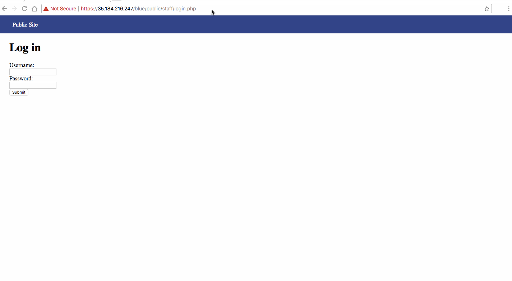
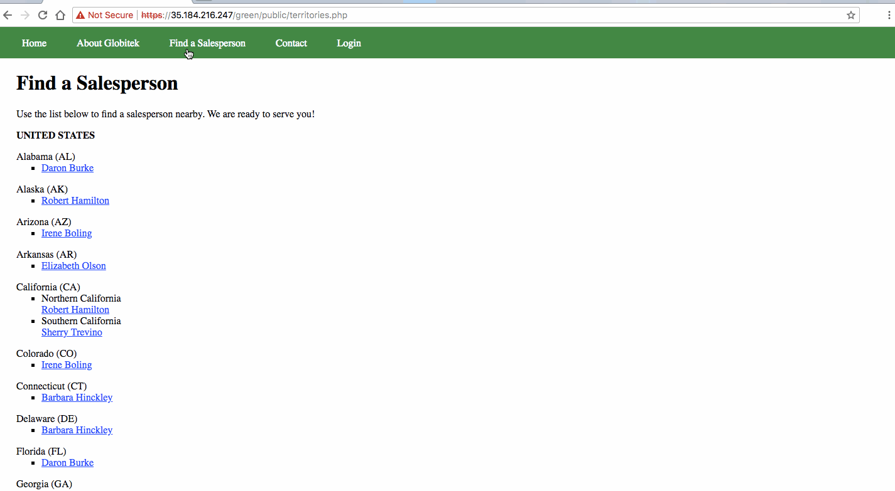
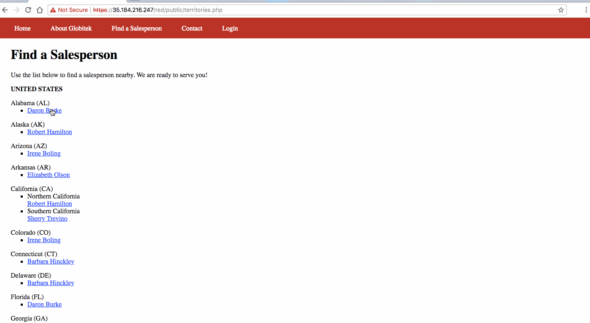
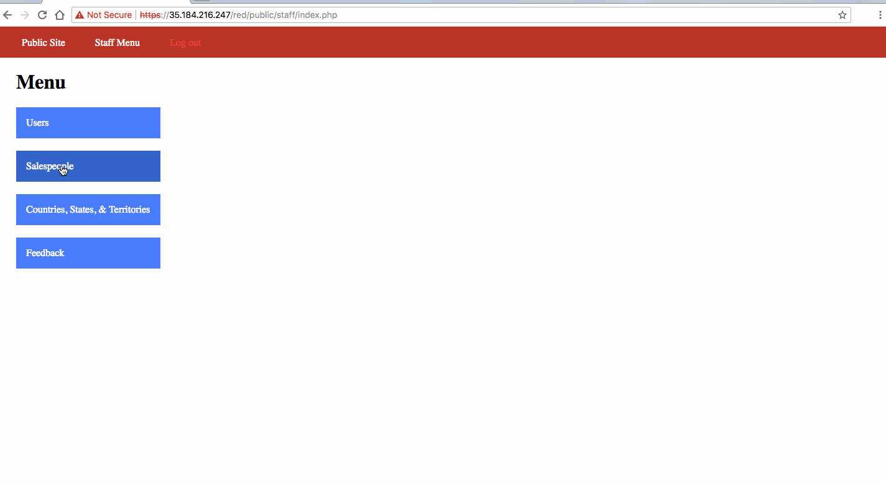
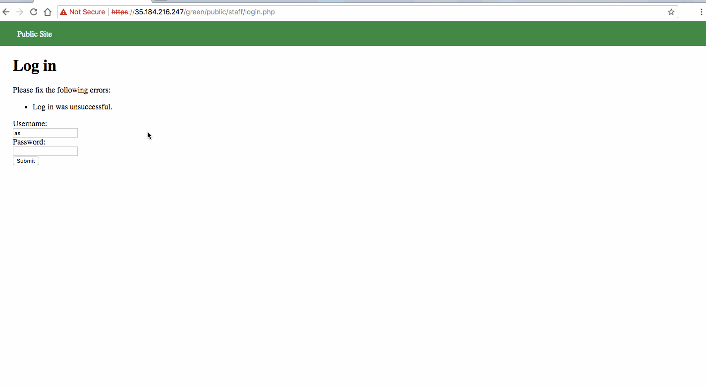

# Week-8-assignment
Time spent: 11 hours spent in total

Vulnerabilty #1 Blue Website: Session Hijacking
Using hacktools we can change PHPSESSIONID and log in to the website from another browser wothout login name or password

Vulnerabilty #2 Blue Website: SQL injection

As we can see blue website is vulnerable to sql injection

Vulnerabilty #1 Red Website:  Insequre Direct Object Reference

Vulnerabilty #2 Red Website:  Cross Site Request Forgery

Vulnerabilty #1 Green Website:  User Enumeration

